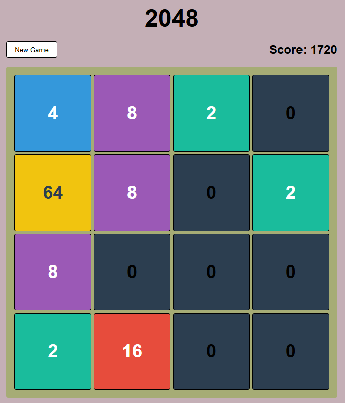

# 2048 Game

A simple 2048 game built with React and TypeScript.

## Features

- Classic 2048 gameplay
- Responsive design
- Keyboard controls (WASD)
- Score tracking
- Game over modal

## Getting Started

### Install dependencies

```sh
npm install
```

### Run the development server

```sh
npm run dev
```

### Run tests

```sh
npm test
```

## Screenshots


